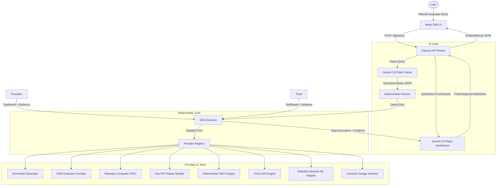
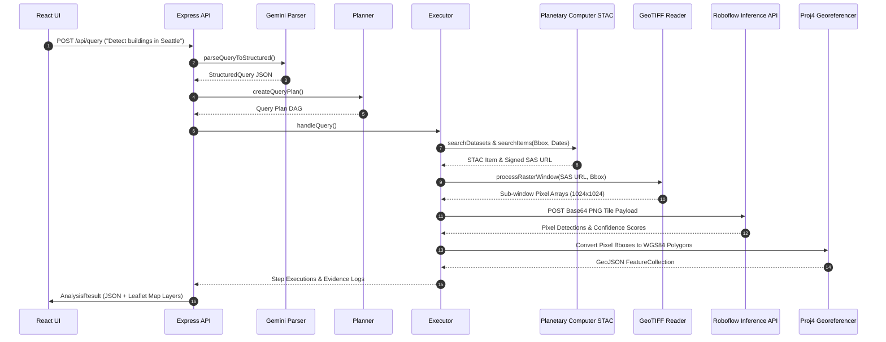
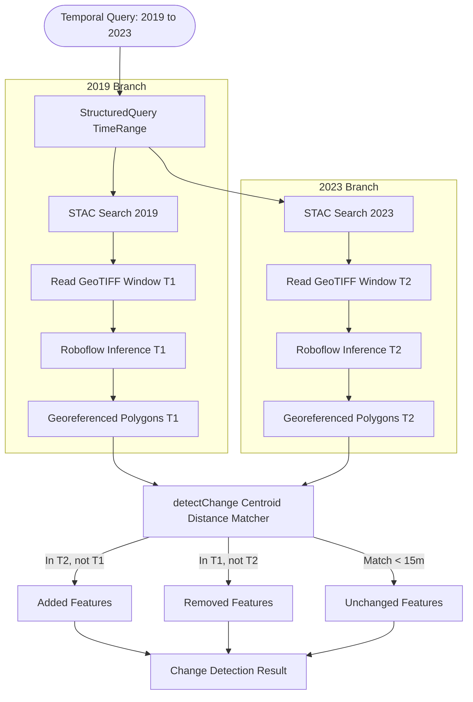

# CogniSights / SATQuery: Technical Architecture & Workflow Specification

This document serves as the definitive technical architecture and workflow specification for CogniSights (SATQuery), a general natural-language geospatial intelligence system.

---

## 1. High-Level Architecture

CogniSights decouples natural language understanding from spatial data processing, satellite asset retrieval, mathematical calculations, and machine learning inference.

```
USER
  │
  ▼
React UI (SPA)
  │ (HTTP POST /api/query)
  ▼
Express API Route (/api/query)
  │
  ├─► Gemini 3.6 Flash ─────────────────────────┐ (AI Query Understanding)
  │     │                                       │
  │     ▼                                       │
  │   StructuredQuery Schema                    │
  │     │                                       │
  │     ▼                                       │
  ├─► Deterministic Planner (planner.ts)        │
  │     │                                       │
  │     ▼                                       │
  │   Query DAG (QueryPlanStep[])               │
  │     │                                       │
  │     ▼                                       │
  ├─► DAG Executor (executor.ts)                │
  │     │                                       │
  │     ▼                                       │
  │   Tool Registry (registry.ts)               │
  │     │                                       │
  │     ├──► Geocoder Provider (Nominatim)      │
  │     ├──► Feature Provider (Overpass)        │
  │     ├──► Dataset Provider (MPC STAC)        │
  │     ├──► Imagery Provider (MPC Items)       │
  │     ├──► Raster Window Reader (GeoTIFF)     │
  │     ├──► NDVI Calculator (Deterministic)    │
  │     ├──► Remote ML Adapter (Roboflow)       │
  │     ├──► Change Detector (Turf Centroids)   │
  │     └──► GIS Engine (Turf Buffer/Intersect) │
  │     │                                       │
  │     ▼                                       │
  │   Step Execution Results + Evidence[]       │
  │     │                                       │
  │     └───────────────────────────────────────┼─► Gemini 3.6 Flash (Synthesis)
  │                                             │     │
  ▼                                             ▼     ▼
React Result View ◄───────────────────────────────── Final Answer Markdown
 (Leaflet Map + Layer Control + Evidence JSON Export)
```

### AI vs. Deterministic Separation
- **AI-Driven Components**:
  1. `parseQueryToStructured()`: Parses free-form user query into a validated `StructuredQuery` JSON object.
  2. `generateFinalAnswer()`: Synthesizes user-facing markdown text strictly grounded in the executed DAG results.
- **Deterministic Components**:
  1. `createQueryPlan()`: Constructs a DAG execution plan based on query fields.
  2. `handleQuery()`: Sequential DAG execution loop, dependency resolution, and state management.
  3. Provider modules: Nominatim geocoding, Overpass OSM queries, STAC catalog searches, GeoTIFF raster windowing, NDVI math, Turf.js spatial operations, `proj4` affine transformations, centroid feature matching, and telemetry logging.

---

## 2. The "LLM–Deterministic Sandwich" Pattern

The core architectural principle of CogniSights is the **LLM–Deterministic Sandwich**. 

```
┌─────────────────────────────────────────────────────────────────────────┐
│ INPUT SIDE (AI): Gemini interprets natural language → StructuredQuery  │
└────────────────────────────────────┬────────────────────────────────────┘
                                     │
                                     ▼
┌─────────────────────────────────────────────────────────────────────────┐
│ MIDDLE LAYER (DETERMINISTIC): Execution Engine                          │
│  - Spatial Geocoding (Nominatim API)                                   │
│  - STAC Catalog Discovery (Microsoft Planetary Computer)                │
│  - SAS Token Signing & Access Verification                             │
│  - GeoTIFF Sub-Window Raster Processing & Sampling                     │
│  - Exact Mathematical Analysis (NDVI = (NIR - RED) / (NIR + RED))       │
│  - Remote ML Model Orchestration & Affine Proj4 Georeferencing          │
│  - Turf.js GIS Operations (Buffer, Intersect, Area)                    │
│  - Deterministic 1-to-1 Centroid Feature Matching (15m Threshold)       │
│  - Immutability & Provenance Evidence Generation                       │
└────────────────────────────────────┬────────────────────────────────────┘
                                     │
                                     ▼
┌─────────────────────────────────────────────────────────────────────────┐
│ OUTPUT SIDE (AI): Gemini synthesizes verified outputs → Final Answer    │
└─────────────────────────────────────────────────────────────────────────┘
```

> [!IMPORTANT]
> **Strict Non-Hallucination Guarantee**: Gemini does **NOT** compute coordinates, invent satellite imagery, create bounding boxes, generate model predictions, or perform spatial math. All geospatial calculations are executed by deterministic code.

---

## 3. Component Responsibility Matrix

| Component | Responsibility | Type | Input | Output |
|---|---|---|---|---|
| **React UI** (`src/App.tsx`) | User interface, query submission, state rendering, map display | Deterministic | User text, AOI string | API Request payload |
| **Express Route** (`api.ts`) | REST API endpoint `/api/query` | Deterministic | HTTP POST JSON | `AnalysisResult` JSON |
| **Gemini Parser** (`gemini.ts`) | Converts text to structured intent | AI (`gemini-3.6-flash`) | Query string, AOI | `StructuredQuery` object |
| **StructuredQuery Schema** (`types/index.ts`) | Zod contract defining query parameters | Deterministic | Raw AI JSON | Validated `StructuredQuery` |
| **Planner** (`planner.ts`) | Builds execution plan steps | Deterministic | `StructuredQuery` | `QueryPlanStep[]` (DAG) |
| **Executor** (`executor.ts`) | Runs DAG steps, manages dependencies & evidence | Deterministic | `QueryPlanStep[]` | `StepExecution[]`, `Evidence[]` |
| **Provider Registry** (`registry.ts`) | Dispatches step names to tool functions | Deterministic | `ToolName`, input data | `ToolResult` |
| **Geocoder** (`geocoderProvider.ts`) | Resolves place names to geographic bounds | Deterministic | Place name string | Bbox & GeoJSON polygon |
| **Overpass Provider** (`geospatialFeatureProvider.ts`) | Queries OpenStreetMap semantic features | Deterministic | Feature type string, Bbox | `GeoJSONFeatureCollection` |
| **STAC Provider** (`imageryProvider.ts`) | Searches STAC collections & items | Deterministic | Date, Bbox, collections | `ImageryMetadata[]`, STAC items |
| **Raster Processor** (`rasterProvider.ts` / `rasterProcessingProvider.ts`) | Signs SAS URLs, reads GeoTIFF windows | Deterministic | STAC items, Bbox | `RasterWindowResult` (pixel arrays) |
| **NDVI Calculator** (`ndviProvider.ts`) | Computes normalized vegetation index | Deterministic | `RasterWindowResult` | `NDVIResult` (statistics) |
| **GIS Provider** (`gisProvider.ts`) | Buffer, intersection, area calculation | Deterministic | Geometries, distance | Geometries, area scalar |
| **Remote Inference Adapter** (`remoteInferenceAdapter.ts`) | Sends PNG tiles to ML endpoint, georeferences | Deterministic | `RasterWindowResult` | `ObjectDetectionResult` (WGS84) |
| **Change Detector** (`changeDetectionProvider.ts`) | Matches T1/T2 features by centroid distance | Deterministic | T1 & T2 Detections | Added, Removed, Unchanged subsets |
| **Evidence Logger** (`types/index.ts`) | Records execution provenance | Deterministic | Tool outputs | `Evidence[]` array |
| **Gemini Synthesizer** (`gemini.ts`) | Converts step outputs to markdown answer | AI (`gemini-3.6-flash`) | Plan & Step executions | Final response markdown |
| **Leaflet Visualization** (`src/App.tsx`) | Renders map layers and evidence JSON | Deterministic | `AnalysisResult` | Interactive UI map |

---

## 4. End-to-End Execution Flow Examples

### Example A: Generic Vector GIS Query
**Query**: *"Find roads within 500m of Pune"*

```
Natural Language: "Find roads within 500m of Pune"
  │
  ▼
Gemini Parser → StructuredQuery:
  - target: "roads"
  - spatialConstraint: { relation: "within 500m", distance: 500 }
  - location: { name: "Pune" }
  │
  ▼
Deterministic Planner → Query Plan DAG:
  1. step_1_resolve_aoi (resolveAreaOfInterest)
  2. step_2_search_target_features (searchGeospatialFeatures: "roads")
  3. step_3_buffer (spatialBuffer: distance=500, units="meters", dep=step_1)
  4. step_4_intersection (spatialIntersection: depA=step_2, depB=step_3)
  │
  ▼
DAG Executor:
  - Step 1: Geocoder queries Nominatim → Pune Bbox: [73.73, 18.41, 73.98, 18.64]
  - Step 2: Overpass queries highway ways in Bbox → LineString FeatureCollection
  - Step 3: Turf.js buffers Pune AOI by 500 meters → Polygon Geometry
  - Step 4: Turf.js intersects roads with buffer Polygon → Intersected FeatureCollection
  │
  ▼
Evidence Logging: Provenance from Nominatim, Overpass API, and Turf.js GIS Engine.
  │
  ▼
Gemini Synthesis: Formats summary of roads found within the 500m buffer zone.
  │
  ▼
Leaflet Map: Displays Pune AOI, 500m buffer polygon, and road vector features.
```

### Example B: Earth Observation & Remote ML Query
**Query**: *"Detect buildings in Seattle"*

```
Natural Language: "Detect buildings in Seattle"
  │
  ▼
Gemini Parser → StructuredQuery:
  - target: "buildings"
  - location: { name: "Seattle" }
  │
  ▼
Deterministic Planner → Query Plan DAG:
  1. step_1_resolve_aoi (resolveAreaOfInterest)
  2. step_2_dataset_target (searchDatasets: "buildings")
  3. step_3_imagery_start (getSatelliteImagery)
  4. step_4_read_raster_start (processRasterWindow)
  5. step_5_preprocess_raster_start (preprocessRaster)
  6. step_6_detect_objects_start (detectObjects / detectBuildings)
  7. step_7_verify (verifyResult)
  │
  ▼
DAG Executor:
  - Step 1: Nominatim geocodes "Seattle" → Bbox: [-122.43, 47.49, -122.22, 47.73]
  - Step 2: STAC collections search matches "naip" / "sentinel-2-l2a"
  - Step 3: Planetary Computer STAC search finds STAC Item (e.g. `wa_m_47122...`)
  - Step 4: SAS URL signed; HEAD check passed; GeoTIFF sub-window sampled (1024x1024)
  - Step 5: Pixel normalization & RGB band ordering
  - Step 6: PNG base64 encoded → Roboflow Remote ML API called → Detections returned
            Pixels georeferenced via proj4 affine transform → WGS84 GeoJSON Polygons
  │
  ▼
Evidence Logging: STAC Item ID, asset key, Roboflow model ID, and acquisition datetime logged.
  │
  ▼
Gemini Synthesis: Formats detection counts and building distribution summary.
  │
  ▼
Leaflet Map: Overlays building detection GeoJSON polygons over Seattle imagery.
```

---

## 5. Temporal Change Detection Workflow

**Query**: *"Detect buildings added or removed between 2019 and 2023 in Seattle"*

```
                              StructuredQuery (TimeRange: 2019 to 2023)
                                                  │
                        ┌─────────────────────────┴─────────────────────────┐
                        ▼                                                   ▼
                DAG Branch T1 (2019)                                DAG Branch T2 (2023)
                        │                                                   │
  STAC Search (datetime=2019-01-01...2019-12-31)      STAC Search (datetime=2023-01-01...2023-12-31)
                        │                                                   │
             Read Raster Window T1                               Read Raster Window T2
                        │                                                   │
          Roboflow Remote ML Inference T1                     Roboflow Remote ML Inference T2
                        │                                                   │
            Georeferenced Polygons T1                          Georeferenced Polygons T2
                        └─────────────────────────┬─────────────────────────┘
                                                  │
                                                  ▼
                                       detectChange Provider
                                                  │
                                 Turf.js Centroid Calculation
                                                  │
                               15-Meter Distance Matching Loop
                                                  │
                         ┌────────────────────────┼────────────────────────┐
                         ▼                        ▼                        ▼
                 Added Features          Removed Features         Unchanged Features
                 (In T2, not T1)         (In T1, not T2)          (In T1 and T2)
                         └────────────────────────┬────────────────────────┘
                                                  │
                                                  ▼
                                          Evidence & Provenance
                                   (Preserves T1 & T2 STAC Datetimes)
```

> [!NOTE]
> **Model-Derived Disclaimer**: Change detection outputs represent algorithmic spatial comparisons of machine-learning detections across two imagery acquisitions. They do **not** constitute physically verified ground-truth construction or demolition records without external validation.

---

## 6. Data Flow Boundaries

| Boundary | Data Transferred | Schema / Representation |
|---|---|---|
| **Client → Server** | Query string, optional AOI | HTTP POST JSON (`{ nlQuery, aoi }`) |
| **Server → Gemini AI** | Prompt string with query context | String prompt |
| **Gemini AI → Planner** | Parsed structured query | `StructuredQuery` (Zod validated) |
| **Planner → Executor** | Step graph | `QueryPlanStep[]` |
| **Executor → Providers** | Step input & dependency outputs | `Record<string, any>` |
| **STAC Provider → Raster Provider** | STAC item metadata & asset URLs | `MpcFeatureCollection` |
| **Raster Provider → Inference Adapter** | Sub-window raw pixel data | `RasterWindowResult` |
| **Inference Adapter → Remote API** | Base64 PNG tile & target classes | `RemoteInferenceRequest` JSON |
| **Remote API → Inference Adapter** | Pixel bboxes, polygons, confidence | `RemoteInferenceResponse` JSON |
| **Inference Adapter → Executor** | Georeferenced WGS84 Polygons | `ObjectDetectionResult` (GeoJSON) |
| **Executor → Gemini AI** | Step execution outputs & status | `PlanExecutionSummary` |
| **Server → Client** | Complete query analysis result | `AnalysisResult` JSON |

---

## 7. Trust & Provenance Model

CogniSights ensures technical trustworthiness through strict validation rules:
1. **Real External Data**: All geographic, imagery, and vector data are queried live from Nominatim, Overpass, and Microsoft Planetary Computer APIs.
2. **Strict Schema Validation**: Zod schemas validate AI query parsing, GeoJSON feature collections, bounding boxes, and remote ML payloads.
3. **Actual Acquisition Datetimes**: Datetimes associated with satellite imagery reflect true STAC metadata timestamps (`properties.datetime`), distinct from user query ranges.
4. **Deterministic Georeferencing**: Pixel bounding boxes are transformed into WGS84 geographic coordinates using native affine transforms (`proj4`).
5. **Immutable Evidence Records**: Every tool execution appends an `Evidence` object containing data source, dataset ID, date, operation, confidence, and provenance URI.
6. **No Synthetic Fallbacks**: If imagery, spectral bands, or endpoints are missing, the system returns explicit `NOT_IMPLEMENTED` or `FAILED` statuses rather than fabricating data.

---

## 8. Failure Flow Scenarios

```
   ┌─────────────────────────────────────────────────────────────┐
   │ Tool Execution Triggered                                    │
   └──────────────────────────────┬──────────────────────────────┘
                                  │
         ┌────────────────────────┼────────────────────────┐
         ▼                        ▼                        ▼
  Upstream Provider       Unsupported Feature       Upstream Step
  Network/HTTP Fail       or Missing Asset          Execution Fail
         │                        │                        │
         ▼                        ▼                        ▼
  status: "FAILED"      status: "NOT_IMPLEMENTED"  status: "SKIPPED"
```

- **FAILED**: Returned when a provider experiences a network timeout, HTTP error after retries, or malformed provider response (e.g. Nominatim timeout).
- **NOT_IMPLEMENTED**: Returned when a requested capability is not supported or required spectral assets are missing (e.g. compute NDVI without NIR band).
- **SKIPPED**: Returned when a downstream DAG step cannot execute because an upstream dependency step did not succeed (`ExecutionState !== "SUCCESS"`).

> [!TIP]
> Explicit status codes prevent silent AI hallucination and provide clear feedback on exact execution limits.

---

## 9. Security Architecture

1. **Server-Side Secret Isolation**: API keys (`GEMINI_API_KEY`, `INFERENCE_API_KEY`, `INFERENCE_API_URL`) are read exclusively from environment variables (`.env`) on the Express server.
2. **Client Bundle Safety**: No secrets or private environment variables are included in the Vite production JS build (`dist/assets/`).
3. **SSRF Mitigation**: Remote inference URLs are sanitized via `RemoteInferenceAdapter.sanitizeUrl()`. All STAC, Nominatim, and Overpass requests are restricted to HTTPS origin endpoints.
4. **Input Schema Hardening**: User input, distance units, bounding boxes, and raster parameters are validated via Zod schemas prior to execution.
5. **Resource Limits**:
   - Max raster window pixels: $4096 \times 4096$ pixels ($16.7\text{M}$ px).
   - Max sub-window sample tile: $1024 \times 1024$ pixels.
   - Max telemetry log entries: $500$ ring-buffer cap.
   - Max retries: $3$ attempts per provider with exponential backoff.
   - Max per-attempt timeout: $30\text{s}$ (Gemini / Overpass), $15\text{s}$ (STAC / Inference), $10\text{s}$ (Nominatim).
6. **Sanitized Error Responses**: Internal exception messages and stack traces are suppressed in client API responses.
7. **Evidence Credential Stripping**: SAS tokens, authorization headers, and API keys are excluded from evidence outputs.

---

## 10. System Architecture Diagrams

### A. High-Level Architecture Diagram


### B. Earth Observation & Building Detection Sequence Diagram


### C. Temporal Change Detection Workflow Diagram


---

## 11. Judge-Friendly Architecture Comparison

### Why is CogniSights reliable compared to asking an LLM about satellite imagery?

Standard Large Language Models (LLMs) cannot process high-resolution multiband satellite imagery natively. When asked spatial questions, standard LLMs hallucinate coordinates, invent detection counts, and guess statistical values.

CogniSights solves this through the **LLM–Deterministic Sandwich**:

1. **LLMs only parse and summarize**: Gemini is used solely to parse user intent into a structured schema and to format final text responses.
2. **Deterministic Data Retrieval**: Real bounding boxes are fetched from OpenStreetMap Nominatim; real satellite scenes are fetched from Microsoft Planetary Computer.
3. **Exact Mathematical Execution**: NDVI calculations, distance buffering, geometry intersections, and coordinate projections are executed by deterministic engines (`@turf/turf`, `proj4`, JavaScript Float32 arrays).
4. **Real Machine Learning Inference**: Object detection is performed on actual satellite raster pixels by a specialized computer vision model (`Roboflow`), not by an LLM guessing from memory.
5. **Auditable Provenance**: Every output is backed by an immutable evidence trail linking back to actual STAC item IDs, asset keys, and satellite pass acquisition timestamps.

---

## 12. Verification & Status

- **Documentation File**: `docs/ARCHITECTURE.md`
- **Application Code Status**: Untouched (0 source file modifications).
- **M41.2 Verification Status**: **PASS**
