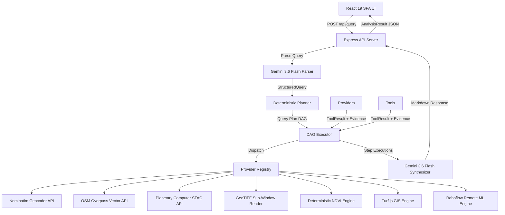

# CogniSights / SATQuery: Official Competition Pitch Deck & Defense Guide

**Natural-Language Earth Observation Analysis with Deterministic Geospatial Execution**

---

## Slide 1 — Title & Vision

### CogniSights / SATQuery
**Natural-Language Earth Observation Analysis with Deterministic Geospatial Execution**

> *"Ask a geospatial question in natural language; receive a reproducible, evidence-backed analysis."*

- **Core Vision**: Bridge the accessibility gap in Earth Observation (EO) intelligence without compromising scientific accuracy or geographic trustworthiness.
- **Architectural Differentiator**: The **LLM–Deterministic Sandwich** pattern—decoupling natural-language intent parsing from spatial calculations, satellite image retrieval, and machine learning inference.

---

## Slide 2 — The Problem

### Earth Observation is Powerful, but Technically Inaccessible

1. **High Barrier to Entry**: Real-world satellite and aerial imagery analysis currently requires specialized expertise in GIS software (QGIS/ArcGIS), STAC catalog APIs, Python GDAL scripting, coordinate reference systems (CRS), and raster band processing.
2. **Catalog & Vector Complexity**: Domain users must manually locate relevant satellite passes, sign token access URLs, download multi-gigabyte GeoTIFF files, and run local ML workflows.
3. **The AI Reliability Dilemma**: While pure Large Language Models (LLMs) make conversational interfaces easy, native LLMs cannot process multi-band raster arrays or calculate spatial geometry—leading to hallucinated coordinates, fake dates, and unverified numbers.

---

## Slide 3 — The Solution

### Conversational Querying Powered by Deterministic Execution

CogniSights decouples language understanding from spatial execution:

```
Natural Language Query ("Detect buildings in Seattle")
  │
  ▼
Gemini AI Intent Parser (StructuredQuery Schema)
  │
  ▼
Deterministic Planner (Query Plan DAG)
  │
  ▼
Live Provider Execution (Nominatim, Overpass, Planetary Computer STAC)
  │
  ▼
Raster Processing & Remote ML Model Inference (Roboflow)
  │
  ▼
Georeferenced Vector Results (proj4 Affine WGS84 Polygons)
  │
  ▼
Immutable Evidence Trail (STAC Item IDs, Pass Timestamps, Model URIs)
  │
  ▼
Human-Readable Answer Synthesis + Leaflet Map Layers
```

- **Core Principle**: *The LLM interprets human intent; deterministic software executes all spatial data processing.*

---

## Slide 4 — Technical Architecture

### Verified Production Stack



- **Frontend**: React 19, TypeScript, Tailwind CSS, Leaflet interactive maps.
- **Backend**: Express Node.js, esbuild CJS bundle, `dotenv` secret isolation.
- **AI Engine**: Gemini 3.6 Flash (query parsing & answer synthesis).
- **Spatial Libraries**: `@turf/turf` (geodesic GIS math), `proj4` (coordinate transformations), `geotiff` (raster sub-window decoding).
- **Resilience Layer**: `fetchWithRetry` (bounded retries, exponential backoff, Retry-After header parsing, ring-buffer telemetry).

---

## Slide 5 — How a Real Query Works

### Primary Walkthrough: *"Detect buildings in Seattle"*

1. **Natural Language Parsing**: Gemini converts prompt into a validated `StructuredQuery` JSON object (`target: "buildings"`, `location: "Seattle"`).
2. **DAG Construction**: Planner builds a 7-step execution plan with dependency linkages.
3. **AOI Geocoding**: Nominatim API resolves "Seattle" to Bbox `[-122.43, 47.49, -122.22, 47.73]`.
4. **Catalog Discovery**: Planetary Computer STAC searches NAIP high-resolution aerial imagery catalogs.
5. **Item & Asset Retrieval**: Retrieves STAC Item ID `wa_m_47122...` and signs a temporary SAS access URL.
6. **Sub-Window Extraction**: Streams a $1024 \times 1024$ pixel sub-window from the GeoTIFF raster asset.
7. **Remote ML Inference**: Encodes tile to base64 PNG and submits to Roboflow building instance segmentation model.
8. **Affine Georeferencing**: Converts pixel-space predictions to `EPSG:4326` WGS84 GeoJSON polygons via `proj4`.
9. **Interactive Map Display**: Leaflet renders georeferenced building polygons over satellite imagery.
10. **Auditable Evidence**: Attaches immutable JSON evidence logging STAC Item ID, satellite pass timestamp, asset key, and Roboflow model provenance.

---

## Slide 6 — Multi-Temporal Change Detection

### Workflow: *"Detect buildings added or removed between 2019 and 2023 in Seattle"*

```
                              StructuredQuery (TimeRange: 2019 to 2023)
                                                  │
                        ┌─────────────────────────┴─────────────────────────┐
                        ▼                                                   ▼
                DAG Branch T1 (2019)                                DAG Branch T2 (2023)
                        │                                                   │
  STAC Search (datetime=2019-01-01...2019-12-31)      STAC Search (datetime=2023-01-01...2023-12-31)
                        │                                                   │
             Read GeoTIFF Window T1                              Read GeoTIFF Window T2
                        │                                                   │
          Roboflow Remote ML Inference T1                     Roboflow Remote ML Inference T2
                        │                                                   │
            Georeferenced Polygons T1                          Georeferenced Polygons T2
                        └─────────────────────────┬─────────────────────────┘
                                                  │
                                                  ▼
                                       detectChange Provider
                                                  │
                               Turf.js 15m Centroid Distance Matcher
                                                  │
                         ┌────────────────────────┼────────────────────────┐
                         ▼                        ▼                        ▼
                 Added Features          Removed Features         Unchanged Features
                 (In T2, not T1)         (In T1, not T2)          (In T1 and T2)
```

> [!NOTE]
> **Model-Derived Change Disclaimer**: Change detection outputs represent algorithmic spatial comparisons of machine-learning building footprints across two satellite scenes. They do **not** constitute physically verified municipal construction or demolition dates.

---

## Slide 7 — Scientific & Geospatial Analysis

### Workflow: *"Analyze vegetation in Pune"*

$$\text{NDVI} = \frac{\text{NIR} - \text{Red}}{\text{NIR} + \text{Red}}$$

1. **Multi-Spectral Raster Reading**: Accesses 4-band satellite assets containing Red (Band 4) and Near-Infrared (Band 8) channels.
2. **Deterministic Pixel Math**: Computes NDVI floating-point array values directly over valid non-NoData pixels.
3. **Strict Guardrails**: Clamps results to $[-1.0, 1.0]$, excludes zero-denominator pixels ($\text{NIR} + \text{Red} = 0$), and ignores NoData background values.
4. **Statistical Summaries**: Calculates min, max, mean, median (P50), 25th percentile (P25), 75th percentile (P75), and standard deviation.
5. **No AI Guessing**: Gemini does **not** calculate or estimate NDVI numbers; statistics are generated deterministically from pixel arrays. Missing spectral bands gracefully return `NOT_IMPLEMENTED`.

---

## Slide 8 — Trust, Provenance, & Security

### Built for Auditability and Production Readiness

- **Server-Side Secret Isolation**: API keys (`GEMINI_API_KEY`, `INFERENCE_API_KEY`, `INFERENCE_API_URL`) remain strictly on the Express server in `.env`. Zero keys bundled into client JS.
- **SSRF Protection**: Remote inference URLs are sanitized via `RemoteInferenceAdapter.sanitizeUrl()`. All STAC, Nominatim, and Overpass requests are restricted to trusted HTTPS domain origins.
- **Resource Bounds**: Hard pixel limits ($4096 \times 4096$ max pixels, $1024 \times 1024$ tile samples, 500 telemetry entries) prevent server memory exhaustion.
- **Retry & Timeout Resilience**: `fetchWithRetry` handles transient HTTP errors (429, 503, timeout) with exponential backoff and `Retry-After` compliance (max 3 retries, 30s timeout).
- **Zod Schema Validation**: Queries, bounding boxes, GeoJSON features, and ML payloads are validated against strict Zod schemas.
- **Auditable Evidence**: Every query output includes exportable JSON evidence containing data sources, STAC Item IDs, asset keys, acquisition datetimes, and model URIs.
- **Explicit Error States**: Unhandled errors, missing credentials, or unsupported features return explicit `FAILED`, `NOT_IMPLEMENTED`, or `SKIPPED` statuses without stack trace leaks.

---

## Slide 9 — Technical Differentiation

### The LLM–Deterministic Sandwich Advantage

| Capability | Traditional Desktop GIS (QGIS/ArcGIS) | Pure LLM Assistant (ChatGPT/Claude Raw) | CogniSights / SATQuery |
|---|---|---|---|
| **Query Interface** | Manual GUI / Python Scripting | Conversational Natural Language | Conversational Natural Language |
| **Data Discovery** | Manual STAC/FTP Download | Unable to Search Live Imagery Catalogs | Automated Live STAC & OSM Discovery |
| **Spatial Calculation** | Deterministic & Accurate | Hallucinated / Unreliable | Deterministic (`@turf/turf` & `proj4`) |
| **Spectral Analysis** | Exact Pixel Formula | Hallucinated Numbers | Exact Floating-Point Matrix Math |
| **Object Detection** | Manual Tool Pipeline | Text Predictions Only | Remote ML Model Tile Inference |
| **Provenance Audit** | Manual Notes | No Verifiable Provenance | Automated Immutable JSON Evidence Trail |
| **Failure Handling** | Software Crashes | Silent Hallucinated Responses | Explicit `FAILED` / `NOT_IMPLEMENTED` States |

---

## Slide 10 — Demonstration, Impact, & Future Scope

### Verified Live Demonstrations
1. **Seattle Building Footprint Detection**: High-resolution NAIP aerial imagery discovery, remote ML building detection, affine WGS84 georeferencing.
2. **Seattle Temporal Building Change (2019 vs 2023)**: Multi-temporal scene comparison, independent ML inference, 15m centroid distance matching.
3. **Pune Vegetation Analysis**: Multi-spectral Sentinel-2 imagery, deterministic NDVI matrix math, statistical summary.
4. **Pune Roads & Hospitals**: Geodesic 500m spatial buffer, Overpass highway vector search, spatial intersection, and hospital amenity lookup.

### Real-World Potential:
- Democratizing satellite imagery access for urban planners, environmental researchers, and emergency responders.
- Providing evidence-backed decision support with auditable data lineage.

### Future Scope (Planned Enhancements):
- Onboard local ONNX model execution to eliminate remote inference network latency.
- Synthetic Aperture Radar (SAR) Sentinel-1 change detection for cloud-covered areas.
- Automated spatial tile caching and offline raster persistence.

> *"Natural language asks the question. Deterministic geospatial execution proves what the data supports."*

---

## Presenter Speaking Notes

### Slide 1 — Title & Vision
- **Speaking Objective (25s)**: Introduce CogniSights as an evidence-backed natural-language Earth Observation platform.
- **Key Points**:
  1. Bridge conversational AI with scientific remote sensing.
  2. The LLM handles language; deterministic software handles spatial data.
  3. Every query produces an exportable, auditable evidence trail.
- **What NOT to Over-Explain**: Do not spend time on initial setup steps; focus immediately on the vision.

### Slide 2 — The Problem
- **Speaking Objective (25s)**: Explain why satellite imagery is hard to use and why native LLMs fail at GIS tasks.
- **Key Points**:
  1. Satellite data requires complex software, band math, and coordinate projections.
  2. Native LLMs hallucinate coordinates, invent fake satellite dates, and guess numbers.
  3. Non-technical users are locked out of Earth Observation insights.
- **What NOT to Over-Explain**: Avoid listing every individual QGIS plugin or tool name.

### Slide 3 — The Solution
- **Speaking Objective (20s)**: Introduce the LLM–Deterministic Sandwich pattern.
- **Key Points**:
  1. Gemini interprets human intent into a structured JSON query schema.
  2. Deterministic code executes geocoding, STAC discovery, raster windowing, and spatial math.
  3. Gemini synthesizes a final markdown explanation grounded in executed step data.
- **What NOT to Over-Explain**: Don't dive into Zod code syntax yet.

### Slide 4 — Technical Architecture
- **Speaking Objective (25s)**: Walk through the verified production tech stack.
- **Key Points**:
  1. React 19 SPA frontend with Leaflet interactive maps.
  2. Express Node.js backend managing DAG execution and tool registry dispatching.
  3. Real data providers: Nominatim, Overpass QL, Planetary Computer STAC, Roboflow ML.
- **What NOT to Over-Explain**: Do not list every NPM package version.

### Slide 5 — How a Real Query Works (Seattle Building Detection)
- **Speaking Objective (30s)**: Step through the primary live demonstration.
- **Key Points**:
  1. Query: *"Detect buildings in Seattle"*.
  2. Geocodes Seattle, searches Planetary Computer STAC for high-resolution NAIP aerial imagery.
  3. Streams GeoTIFF raster window, submits PNG tile to Roboflow ML model.
  4. Transforms pixel predictions to WGS84 GeoJSON polygons using `proj4`.
- **What NOT to Over-Explain**: Do not call NAIP imagery "satellite" imagery (it is high-resolution aerial imagery).

### Slide 6 — Multi-Temporal Change Detection
- **Speaking Objective (30s)**: Explain parallel DAG execution for temporal queries.
- **Key Points**:
  1. Query: *"Detect buildings added or removed between 2019 and 2023 in Seattle"*.
  2. Constructs independent T1 (2019) and T2 (2023) imagery & inference branches.
  3. Matches building centroids within 15 meters to output Added, Removed, and Unchanged layers.
- **What NOT to Over-Explain**: Emphasize that this is model-derived scene comparison, not municipal ground-truth verification.

### Slide 7 — Scientific & Geospatial Analysis (Pune Vegetation)
- **Speaking Objective (25s)**: Demonstrate exact mathematical NDVI calculation.
- **Key Points**:
  1. Query: *"Analyze vegetation in Pune"*.
  2. Reads multi-spectral Red (B04) and NIR (B08) pixel arrays.
  3. Computes $(NIR - Red) / (NIR + Red)$ deterministically with NoData filtering.
  4. Calculates min, max, mean, median, P25, and P75 statistics.
- **What NOT to Over-Explain**: Do not say Gemini calculated the numbers; emphasize the pixel matrix engine.

### Slide 8 — Trust, Provenance, & Security
- **Speaking Objective (25s)**: Reassure judges about security, secrets, and provenance integrity.
- **Key Points**:
  1. All API keys remain server-side in `.env` (zero client JS leakage).
  2. Hard resource limits ($4096 \times 4096$ max pixels) prevent memory overflow.
  3. Evidence records log exact STAC Item IDs, acquisition timestamps, and model URIs.
  4. Explicit `FAILED` / `NOT_IMPLEMENTED` states prevent silent hallucinations.
- **What NOT to Over-Explain**: Do not claim the system is "100% unhackable".

### Slide 9 — Technical Differentiation
- **Speaking Objective (20s)**: Highlight key advantages over desktop GIS and pure LLMs.
- **Key Points**:
  1. Easier than traditional desktop GIS (natural language vs manual GUI).
  2. Infinitely more reliable than pure LLMs (deterministic spatial calculations vs hallucinated text).
  3. Fully auditable through exportable evidence JSON.
- **What NOT to Over-Explain**: Avoid criticizing competitors by name; focus on architectural paradigms.

### Slide 10 — Demo, Impact, & Future Scope
- **Speaking Objective (25s)**: Summarize live demos, real-world impact, and closing vision.
- **Key Points**:
  1. Primary demo: Seattle Buildings; Secondary demos: Seattle Change & Pune Vegetation.
  2. Future scope: Onboard local ONNX inference & Sentinel-1 SAR radar change detection.
  3. Closing quote: *"Natural language asks the question. Deterministic geospatial execution proves what the data supports."*
- **What NOT to Over-Explain**: Keep future scope strictly labeled as planned future work.

---

## Judge Attention Points

### The 5 Strongest Technical Differentiators:
1. **LLM–Deterministic Sandwich Architecture**: Language parsing and textual synthesis are handled by AI, but 100% of spatial calculations, imagery fetches, and GIS operations are executed by deterministic code.
2. **Live STAC Catalog & OpenStreetMap Integration**: Queries live Planetary Computer STAC catalogs, OpenStreetMap Nominatim geocoding, and Overpass vector databases in real-time.
3. **Exact Mathematical NDVI Matrix Engine**: Computes normalized difference vegetation index statistics directly over floating-point GeoTIFF pixel arrays rather than estimating values via text model.
4. **Affine Georeferencing via Proj4**: Transforms raw pixel bounding boxes from sub-window raster tiles into standard `EPSG:4326` WGS84 GeoJSON polygons.
5. **Auditable Evidence & Provenance Trail**: Every query produces an exportable JSON evidence report detailing exact STAC Item IDs, satellite acquisition timestamps (`properties.datetime`), asset keys, and remote ML model identifiers.

---

## Claims Requiring Care (Presenter Avoidance Checklist)

- **Do NOT claim 100% detection accuracy**: Object detection performance depends on remote ML inference weights.
- **Do NOT claim physical ground-truth construction or demolition dates**: Change maps represent algorithmic footprint comparisons between satellite acquisitions.
- **Do NOT claim verified Precision, Recall, IoU, or F1 metrics**: Model benchmark scores have not been independently evaluated against a ground-truth dataset in this repository.
- **Do NOT claim zero-latency execution**: Live cloud API queries and GeoTIFF tile streaming require network time.
- **Do NOT claim offline operation**: The system requires active network connections to query STAC, Nominatim, Overpass, and Roboflow APIs.
- **Do NOT claim absolute hallucination-free operation**: Gemini intent parsing is schema-validated, but edge-case query parsing relies on LLM understanding.
- **Do NOT call NAIP imagery "satellite imagery"**: NAIP imagery is high-resolution aerial orthoimagery.
- **Do NOT invent fake model names or satellite dates**: Use actual metadata reported by STAC items and inference API endpoints.

---

## Source-of-Truth Note

All technical capabilities, architecture diagrams, data flows, and workflow explanations detailed in this pitch deck and defense guide are strictly derived from verified codebase implementations and completed audit specifications (`docs/ARCHITECTURE.md`, `docs/SIH_PROBLEM_MAPPING.md`, `docs/DEMO_STRATEGY.md`).
